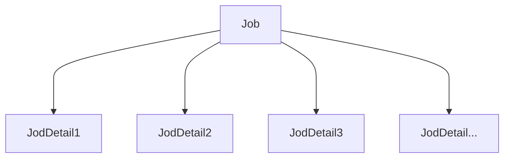

# SpringBoot-Scheduling

用來做定期任務的東西，有兩種

+ Spring schedule：只適合處理簡單的計畫任務，不能處理分散式的任務，當任務太多時，可能出現阻塞、崩潰、延遲啟動等問題
+ Quartz：更強大的一個排程器，能夠配置上百甚至上千的事務。


# Spring Schedule


## 步驟

1. 在啟動類上加上@EnableScheduling

```java
@SpringBootApplication()
@EnableScheduling
public class Application {
    public static void main(String[] args) {
        SpringApplication.run(Application.class, args);
    }
}
```

2. 在方法上加上@Scheduled

```java
@Component
public class Task {
    @Scheduled(fixedDelay = 10 * 100)
    public void printLocalTime() {
        System.out.println(LocalTime.now().toString());
    }
}
```


```java
    @Scheduled(cron = "1 * * * * ?",zone = "Asia/Taipei")
    public void printPer5second(){
        log.info("cron");
    }
```


```java
@Scheduled(cron = "0/1 * * * * ?",zone = "Asia/Taipei")
public void printPer5second(){
    log.info("cron");
}
```


## Cron表達式(七子表達式)

[表達式生成工具](https://cron.qqe2.com/)

Cron語源來自Chronos，是希臘神話中掌管時間的神柯羅諾斯(Chronos)。

| 秒   | 分   | 時   | 日   | 月   | 周   | 年(可選) |
| ---- | ---- | ---- | ---- | ---- | ---- | -------- |
| 1    | *    | *    | *    | *    | ?    | ?        |


+ 秒：0-59
+ 分：0-59
+ 時 ：0-23
+ 日：1-31
+ 月：0-11或"JAN, FEB, MAR, APR, MAY, JUN, JUL, AUG, SEP, OCT, NOV, DEC"
+ 周：1-7或SUN, MON, TUE, WED, THU, FRI,SAT
+ 年

想像一個時鐘...


| 當每次秒針指向一秒時        | 1 * * * * ?    |
| --------------------------- | -------------- |
| 當每次時針指向12時          | * * 12 * * ?   |
| 每個月 1 號中午 12 點       | 0 0 12 1 * ?   |
| 1 月每天中午 12 點，每 5 秒 | 0/5 0 12 * 1 ? |


| 字元 | 意義                                                         |
| :--- | :----------------------------------------------------------- |
| `*`  | 表達任意值，所有值都可以匹配                                 |
| `?`  | 只用在 `日` 跟 `周` 的值域，有點表達 don’t care 的概念，無所謂，不關心到底是什麼值 |
| `-`  | 指定範圍，前後接數字: 10-12                                  |
| `,`  | 指定離散的選項: 1,5,6,8，或者的概念                          |
| `/`  | 指定增量，表達 `每` 的概念: 0/5 意旨從 0 開始每 5 單位       |
| `L`  | 用在 `月` 跟 `周` 的值域。在月的話表達最後一天，在周的話前面可以加上數字 3L 表示該月最後一個星期二 |
| `W`  | 用在`日`的值域表示距離最近的該月工作日: 15W，距離 15 號最近的工作日，可能往前也可能往後 |
| `LW` | 用在`日`的值域，表示最後一周的工作日                         |
| `#`  | 用在`周`的值域，指定特定周的特定日: “4#2” 表示第二周的星期三 |
| `C`  | 用在`日`跟`周`的值域，指某特定個日期的後一天: 在`日`中寫 3C 指該月 3 號的後一天，在`周`中寫 2C 指該周星期一的後一天 |


# Quartz


是一個開源的任務排程器，幾乎可以整合到任何Java應用程式中。

它可以用來

+ 安排每個晚上把資料庫內容轉存到檔案
+ 提供定時提醒服務
+ 族繁不及備載...


### 底層數據結構- 堆


#### 介紹

堆是一種特殊的樹，滿足下面兩個條件，就是一個**堆**

1. 堆是一顆完全二元樹`完整二元樹：除了最後一層以外，其他層的節點數需要達到最大(1,2,4,8. ..)`


2. 每個節點所儲存的值，必須要大於`小頂堆`或小於`大頂堆`父節點的值


> 小頂堆


完整二元樹的一些特性：快速定位父節點


**在排程器的框架中，每一個節點就是一個Job，越頻繁的Job會被放置在越上層的節點**


#### 如何插入元素

尾插法，在尾部插入一個新的元素，然後上浮，浮到符合定義

1. 除了最後一層以外，其他層的節點數需要達到最大(1,2,4,8. ..)，且最後一層節點都靠左排列
2. 每個節點所儲存的值，必須要大於`小頂堆`或小於`大頂堆`父節點的值


#### 如何刪除元素

將尾部(最後一個節點)放置到堆頂，然後下沉


### 時間輪算法(Time Wheel)


再刪除元素的時候都需要下沉，當節點數很多時會造成性能延宕


#### round 型的時間輪

任務上記錄一個round，遍歷到了就將round減一，為0時取出來執行

#### 分層時間輪

Cron表達式以及其他排程器所採用的底層架構，分成秒輪、分輪、小時輪、日輪、周輪、月輪、年輪...，月輪迭代到了，就將任務取出放到天輪中執行...，以此類推

## Cron表達式(七子表達式)

[表達式生成工具](https://cron.qqe2.com/)

Cron語源來自Chronos，是希臘神話中掌管時間的神柯羅諾斯(Chronos)。

| 秒   | 分   | 時   | 日   | 月   | 周   | 年(可選) |
| ---- | ---- | ---- | ---- | ---- | ---- | -------- |
| 1    | *    | *    | *    | *    | ?    | ?        |


+ 秒：0-59
+ 分：0-59
+ 時 ：0-23
+ 日：1-31
+ 月：0-11或"JAN, FEB, MAR, APR, MAY, JUN, JUL, AUG, SEP, OCT, NOV, DEC"
+ 周：1-7或SUN, MON, TUE, WED, THU, FRI,SAT
+ 年

想像一個時鐘...


| 當每次秒針指向一秒時        | 1 * * * * ?    |
| --------------------------- | -------------- |
| 當每次時針指向12時          | * * 12 * * ?   |
| 每個月 1 號中午 12 點       | 0 0 12 1 * ?   |
| 1 月每天中午 12 點，每 5 秒 | 0/5 0 12 * 1 ? |


| 字元 | 意義                                                         |
| :--- | :----------------------------------------------------------- |
| `*`  | 表達任意值，所有值都可以匹配                                 |
| `?`  | 只用在 `日` 跟 `周` 的值域，有點表達 don’t care 的概念，無所謂，不關心到底是什麼值 |
| `-`  | 指定範圍，前後接數字: 10-12                                  |
| `,`  | 指定離散的選項: 1,5,6,8，或者的概念                          |
| `/`  | 指定增量，表達 `每` 的概念: 0/5 意旨從 0 開始每 5 單位       |
| `L`  | 用在 `月` 跟 `周` 的值域。在月的話表達最後一天，在周的話前面可以加上數字 3L 表示該月最後一個星期二 |
| `W`  | 用在`日`的值域表示距離最近的該月工作日: 15W，距離 15 號最近的工作日，可能往前也可能往後 |
| `LW` | 用在`日`的值域，表示最後一周的工作日                         |
| `#`  | 用在`周`的值域，指定特定周的特定日: “4#2” 表示第二周的星期三 |
| `C`  | 用在`日`跟`周`的值域，指某特定個日期的後一天: 在`日`中寫 3C 指該月 3 號的後一天，在`周`中寫 2C 指該周星期一的後一天 |


​	

## 重要API及概念

> 記得Job類一定要是**public class**，不然Scheduler會讀不到


釋例一：

```java
public class Quartz {
    public static void main(String[] args) {
        MyJob myJob = new MyJob();
        JobDetail jobDetail = JobBuilder.newJob(MyJob.class)
                .withIdentity("job1", "group1")
                .build();

        Trigger trigger = TriggerBuilder.newTrigger()
                .withIdentity("trigger1", "trigger1")
                .startNow()
                .withSchedule(SimpleScheduleBuilder.simpleSchedule().withIntervalInSeconds(1).repeatForever())
                .build();

        try {
            Scheduler scheduler = StdSchedulerFactory.getDefaultScheduler();
            scheduler.scheduleJob(jobDetail,trigger);
            scheduler.start();
        } catch (SchedulerException e) {
            throw new RuntimeException(e);
        }
        ;


    }
}
```

```java
public class MyJob implements Job {
    @Override
    public void execute(JobExecutionContext jobExecutionContext) throws JobExecutionException {
        System.out.println("MyJob execute:" + new Date());
    }
}
```


釋例二


```java
public class HelloJob {
    public static void main(String[] args) {
        try {
            Scheduler scheduler = StdSchedulerFactory.getDefaultScheduler();
            scheduler.start();
            JobDetail jobDetail = JobBuilder.newJob(SayHello.class)
                    .withIdentity("job1", "group1")  //Job1是名字，具有唯一性，group1是這個Job屬於哪一組，同一組的Job可以共享相同的邏輯來處理Job。需要name與Job才可以組成一個JobKey
                    .usingJobData("username", "Hoxton")
                    .usingJobData("age", "20")
                    .withDescription("desc-demo")
                    .build();

            SimpleTrigger trigger = TriggerBuilder.newTrigger()
                    .withIdentity("trigger1", "group1")
                    .startNow()
                    .withSchedule(SimpleScheduleBuilder.simpleSchedule().withIntervalInSeconds(1).repeatForever())
                    .build();

            scheduler.scheduleJob(jobDetail,trigger);
            scheduler.start();

//            scheduler.shutdown();
        } catch (SchedulerException e) {
            throw new RuntimeException(e);
        }
    }
}
```

```java
@Slf4j
@NoArgsConstructor
public class SayHello implements Job {

    @Override
    public void execute(JobExecutionContext context) throws JobExecutionException {
        JobDetail jobDetail = context.getJobDetail();//從context中獲取屬性
        JobKey key = jobDetail.getKey();
        Class<? extends Job> jobClass = jobDetail.getJobClass();
        String description = jobDetail.getDescription();

        JobDataMap jobDataMap = jobDetail.getJobDataMap();
        String username = jobDataMap.getString("username");
        int age = jobDataMap.getIntValue("age");

        log.info("\nJobKey : {},\n JobClass : {},\n JobDesc : {},\n username : {},\n age : {}",
                key, jobClass.getName(), description, username, age);
    }
}
```

###  Scheduler

生命週期由ScheduleFactory建立開始，呼叫shutdown方法結束。

當Schduler建立，任何關於Schduling相關的事情，都由它控制

+ 新增
+ 刪除
+ 列出所有Job
+ 暫停觸發器

**在Start之前不會做任何事情**

### Job

你希望被排程器排程的任務元件介面，定義如何執行，是正在執行的作業例項，一個Job可以建立多個JobDetail，擁有不同的JobDataMap。本身implement了Job類





```java
public class SendEmail implements Job {
    @Override
    public void execute(JobExecutionContext jobExecutionContext) throws JobExecutionException {
        System.out.println("SendEmail");
    }
}
```


+ 當Job的觸發器觸發時，排程程式的工作執行將呼叫excute()方法
+ 該方法接收一個`JobExcutionContext`物件，為Job提供了豐富的執行時環境，比如`schduler`,`trigger`,`jobDataMap`,`job`,`calender`,`time`


> 何謂Context(上下文)
>
> 可以理解為環境、容器的意思會比上下文更具體一點，它提供了一個程式中全域性的資訊。


### JobDetail

用於定義Job的各種屬性、各種任務，還可以用來為Job儲存狀態資訊的JobDataMap，是將Job加入scheduler時，所需要創建的一個物件，它包含了各種屬性設置，以及用於存取job實例狀態訊息的JobDataMap，在創建JobDetail時，需要將欲執行的類名傳遞給JobDetail，這樣schedule就知道要執行何種類型的job。

```java
JobDetail jobDetail=JobBulider.newJob(Job.class).bulid();
```


### JobDataMap

實作Map介面，因此具有Key-Value，儲存可序列化資料，供Job在執行時使用。也可以使用`usingJobData(key,value)`在建構JobDetail的時候傳入資料，使用JobDetail.getDataMap()獲取Map。可以再透過jobDataMap取出裡面的數據

```java
 JobDetail job = JobBuilder.newJob(HelloJob.class)
 		                  .withIdentity("helloJob", "hello")//給job命名並分組
 		                  .usingJobData("jobdd", "hello job")//通過JobBuilder的usingJobData方法給JobDataMap中塞入數據
 		                  .build();

```

```java
public class HelloJob implements Job {

	@Override
	public void execute(JobExecutionContext context) throws JobExecutionException {
		System.err.println(context.getJobDetail().getKey());// JobDetail的key又他的name和group組成
		System.err.println(context.getTrigger().getKey());// Trigger的key又他的name和group組成
		System.err.println(context.getJobDetail().getJobDataMap().get("jobdd"));
		System.err.println("hello,quartz");
	}
}
```

會輸出

`hello.helloJob

hello.helloTrigger

hello job

hello, quartz

### Trigger

觸發任務執行，觸發器可能具有與Job有關的JobDataMap，以便將觸發器觸發的引數傳遞給Job，Quartz本身提供了幾種觸發器`SimpleTrigger`和`CronTrigger`是最常用到的。

#### **SimpleTriger**

用於一次性執行作業或需要在給定的時間觸發一個作業並重複執行N次，且兩次執行時間有Delay。用在具體的時間點，並已指定的間隔時間重複執行若干次，它包含了幾種屬性：

1. 開始時間
2. 結束時間
3. 重複次數
4. 重複間隔


釋例一：立刻觸發一次，然後停止

```java
  Date date = new Date();
        Trigger trigger1 = TriggerBuilder.newTrigger()
                .withIdentity("trigger1", "group1")
                .startAt(date)
                .build();
```

釋例二：指定時間觸發，每隔十秒執行一次，重複10次

```java
 trigger = newTrigger()
        .withIdentity("trigger3", "group1")
        .startAt(myTimeToStartFiring)  // if a start time is not given (if this line were omitted), "now" is implied
        .withSchedule(simpleSchedule()
            .withIntervalInSeconds(10)
            .withRepeatCount(10)) // note that 10 repeats will give a total of 11 firings
        .forJob(myJob) // identify job with handle to its JobDetail itself                   
        .build();
```

釋例三：5分鐘以後開始觸發，僅執行一次

```java
 trigger = (SimpleTrigger) newTrigger() 
        .withIdentity("trigger5", "group1")
        .startAt(futureDate(5, IntervalUnit.MINUTE)) // use DateBuilder to create a date in the future
        .forJob(myJobKey) // identify job with its JobKey
        .build();
```

釋例四：立即觸發，每個5分鐘執行一次，直到22:00：

```java
trigger = newTrigger()
        .withIdentity("trigger7", "group1")
        .withSchedule(simpleSchedule()
            .withIntervalInMinutes(5)
            .repeatForever())
        .endAt(dateOf(22, 0, 0))
        .build();
```

釋例五：在下一小時整點觸發，每個2小時執行一次，一直重複：

```java
  trigger = newTrigger()
        .withIdentity("trigger8") // because group is not specified, "trigger8" will be in the default group
        .startAt(evenHourDate(null)) // get the next even-hour (minutes and seconds zero ("00:00"))
        .withSchedule(simpleSchedule()
            .withIntervalInHours(2)
            .repeatForever())
        // note that in this example, 'forJob(..)' is not called which is valid 
        // if the trigger is passed to the scheduler along with the job  
        .build();

    scheduler.scheduleJob(trigger, job);
```


#### **CronTrigger**

希望以日期作為觸發任務的板機，就用CronTriger，**實務上比較常用這個**

```java
    CronTrigger trigger2 = TriggerBuilder.newTrigger()
                .withIdentity("trigger3", "group1")
                .withSchedule(CronScheduleBuilder.cronSchedule("0/2 * * * * ?"))
                .build();
```

```java
package com.how2java;
   
import static org.quartz.CronScheduleBuilder.cronSchedule;
import static org.quartz.JobBuilder.newJob;
import static org.quartz.TriggerBuilder.newTrigger;
import static org.quartz.SimpleScheduleBuilder.simpleSchedule;
  
import java.util.Date;
 
import org.quartz.CronTrigger;
import org.quartz.DateBuilder;
import org.quartz.JobDetail;
import org.quartz.Scheduler;
import org.quartz.SimpleTrigger;
import org.quartz.impl.StdSchedulerFactory;
   
public class TestQuartz {
    public static void main(String[] args) throws Exception{
            Scheduler scheduler = StdSchedulerFactory.getDefaultScheduler();
   
            Date startTime = DateBuilder.nextGivenSecondDate(null, 8);
  
            JobDetail job = newJob(MailJob.class).withIdentity("mailJob", "mailGroup").build();
  
            CronTrigger trigger = newTrigger().withIdentity("trigger1", "group1").withSchedule(cronSchedule("0/2 * * * * ?"))
                    .build();
  
            // schedule it to run!
            Date ft = scheduler.scheduleJob(job, trigger);
             
            System.out.println("使用的Cron表达式是："+trigger.getCronExpression());
//            System.out.printf("%s 这个任务会在 %s 准时开始运行，累计运行%d次，间隔时间是%d毫秒%n", job.getKey(), ft.toLocaleString(), trigger.getRepeatCount()+1, trigger.getRepeatInterval());
             
            scheduler.start();
               
            //等待200秒，让前面的任务都执行完了之后，再关闭调度器
            Thread.sleep(200000);
            scheduler.shutdown(true);
    }
}
```


### JobBulider

用來建立[JobDetail](#JobDetail)

```java
 JobDetail jobDetail = JobBuilder.newJob(某個繼承了Job的類)...
 
     JobDetail jobDetail = JobBuilder.newJob(SayHello.class)
                    .withIdentity("job1", "group1")
                    .usingJobData("username", "Hoxton")
                    .usingJobData("age", "20")
                    .withDescription("desc-demo")
                    .build();
```


TriggerBulider

用於建立[Trigger](#Trigger)


### Identity

當Job和Trgger在Quartz排程程式中註冊時，會獲得標示鍵，`JobKey`和`TriggerKey`置入group中，易於組織管理，其中name與group必須**唯一**


### 為何要將Job和Trigger分開來?

> While developing Quartz, we decided that it made sense to create a separation between the schedule and the work to be performed on that schedule. This has (in our opinion) many benefits.
>
> For example, Jobs can be created and stored in the job scheduler independent of a trigger, and many triggers can be associated with the same job. Another benefit of this loose-coupling is the ability to configure jobs that remain in the scheduler after their associated triggers have expired, so that that it can be rescheduled later, without having to re-define it. It also allows you to modify or replace a trigger without having to re-define its associated job.


## Job與JobDetail的一些說明

+ Job是正在執行的作業，JobDetail則是作業的定義
+ 一個Job可以創建多個JobDetail，擁有不同的JobDataMap

舉例來說，今天寫了一個定時寄送信件的Job，叫做SendEmailJob，我們希望這個Job可以寄給客戶，然後在cc給你的主管，所以需要創建兩個不同的JobDetail，比如說SendEmailToClient、SendEmailToAdministor，並透過JobDataMap綁定參數傳遞至JobDetail中，這兩個JobDetail擁有各自獨立的JobDataMap，實現起來會更靈活。


# 參考


[官方文檔](http://www.quartz-scheduler.org/documentation/quartz-2.3.0/quick-start.html)

[任務排程框架Quartz快速入門](https://iter01.com/575275.html)

[Quartz教學基礎](https://www.1ju.org/quartz/index)

[觸發器詳細定義](https://www.796t.com/content/1545519797.html)
